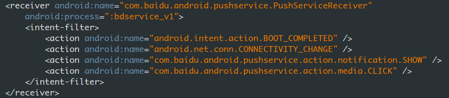

#### 百度push Android客户端调研

1. 百度[云push][1]基于[frontia][2]push模块封装，区别在于封装后的云推送样式场景更丰富

2. 使用Android SDK时，需要在Manifest中声明组件
> PushService，进程空间为私用进程，同时暴露给外部调用  
>   
>  
> PushServiceReceiver，进程空间为私用进程，支持开机启动，支持监听网络变化  
>   
>  
> RegistrationReceiver，支持卸载监听  
>   

3. 使用Android SDK时，需要在Manifest中声明key
> api_key  
>   

4. 按照sdk FrontiaApplication使用，追踪代码
> 继承FrontiaApplication  
> 先解密，其中解密失败进行进行dex加载  
>   
>  
> 解密成功再判断当前应用是否启动过PushService  
>   
>  
> 如果启动过PushService，则进行dex加载，可能会涉及到push服务本地核心库的静默更新，如果没有启动过则不做任何操作  
>   
>   
>  
> 具体调用DexClassLoader加载，这个过程会加载plugin-deploy.jar中的dex文件  
>   

4. 按照sdk启动PushService使用，追踪代码
> 在App中以apkkey方式启动  
>   
>  
> PushManager.startWork执行很有意思，先调用sdk里面PushManager方法  
>   
>  
> BridgePushManager中调用plugin-deploy.jar中PushManager的代码  
> sdk中的PushManager和plugin-deploy.jar中的PushManager包名是不同的，中间的桥接关系由BridgePushManager类完成，可以看作一种桥接模式吧  
>   
>  
> 然后使用LoadExecutor.excuteMethod执行BridgePushManager.startWork，发现LoadExecutor初始化部分去加载sdk中plugin-deploy.jar中的dex文件，那么具体执行startWork的工作就是plugin-deploy.jar中的PushManager来完成  
>   
>   
> 注：在这里可以看出plugin-deploy.jar可以作为插件库，完成静默更新  
>  
> plugin-deploy.jar中PushManager的startWork
>   
>  
> 其中关键代码在于bind()函数，该函数发送广播  
>   
>  
> 广播发给谁具体由a()函数中Internal.createBdussInent()或者PushConstants.createMethodIntent()  
>   
>  
> 其中createBdussInent()函数又调用了n.g()函数，其中n.g()函数中通过调用n.d()函数返回intent，或者createMethodIntent()函数直接调用n.d()函数返回intent，发现此刻intent的action设置为com.baidu.android.pushservice.action.METHOD，回到应用的manifest，注册过RegistrationReceiver的intent-filter中果然有com.baidu.android.pushservice.action.METHOD  
>   
>  
> 进入RegistrationReceiver类，然后立刻定位到onReceive()函数，代码混淆的执行流有点乱，但是还是找到一个函数调用b.a(paramContext, paramIntent)  
>   
>  
> 更进b.a(paramContext, paramIntent)，其中代码启动了PushService服务  
>   
>  
> 定位到PushService的onCreate，onStartCommand，onDestroy生命周期函数  
> onCreate()创建服务，在initPushSDK()中判断是否应该启动本服务，如果判断不应该启动本服务则调用a()函数  
>   
>  
> initPushSDK()  
>   
>  
> initPushSDK()中调用a()函数通过优先级配置项，决定本服务是否启动  
>   
>   
>  

#### 现有方案[选型][3]

##### 参考
[1]: http://developer.baidu.com/wiki/index.php?title=docs/cplat/push "百度云推送"
[2]: http://developer.baidu.com/wiki/index.php?title=docs/frontia/guide-android/push "frontia推送"
[3]: http://www.zhihu.com/question/20628786 "推送方案选型"